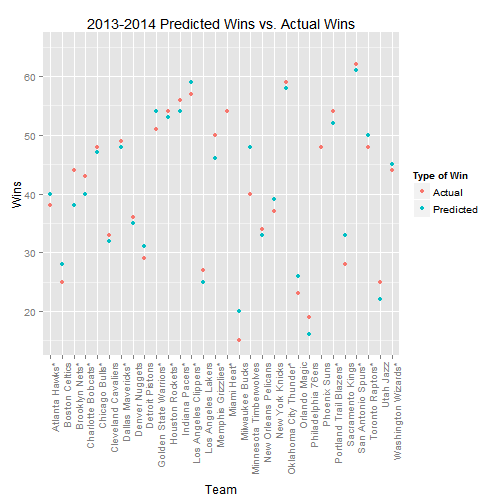

## Introduction

This application has been built to calculate the Pythagorean Wins an NBA team will have.

- The concept was first developed by baseball statisticians and later used in basketball.
- Pythagorean Wins calculate the approximate winning percentage a team should have based on their total points scored and total points allowed. 
- The discrepancy between predicted wins and actual wins can be interpreted as "luck".

--- .class 

## Use for App

This app is useful for the satistical minded basketball fan. Using this app you can see how many games your favorite team should have won. When armed with this knowledge they can see whether their team is over or under achiving, and from there figure out why this is the case. 

The next slide will show how difference between predicted Pythagorean Wins and actual wins from the previous season. You can see the predicted wins are generally very close to the actual wins.

--- .class 

## 2013-2014 Predicted Wins vs. Actual Wins


```r
plot + geom_point(aes(y=Actual, color = "Actual")) +
    scale_color_discrete(name = "Type of Win")
```

 


--- .class 

## Further info

- The app can be found here: https://tylercrain.shinyapps.io/Project/

- Where to find basketball data: http://www.basketball-reference.com/leagues/NBA_2015.html

- A github repository with all code for the app and this slideshow : 
https://github.com/TylerCrain/developing_data_products
